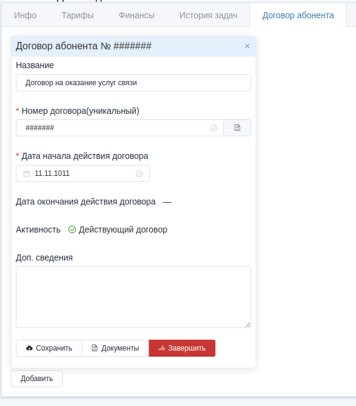
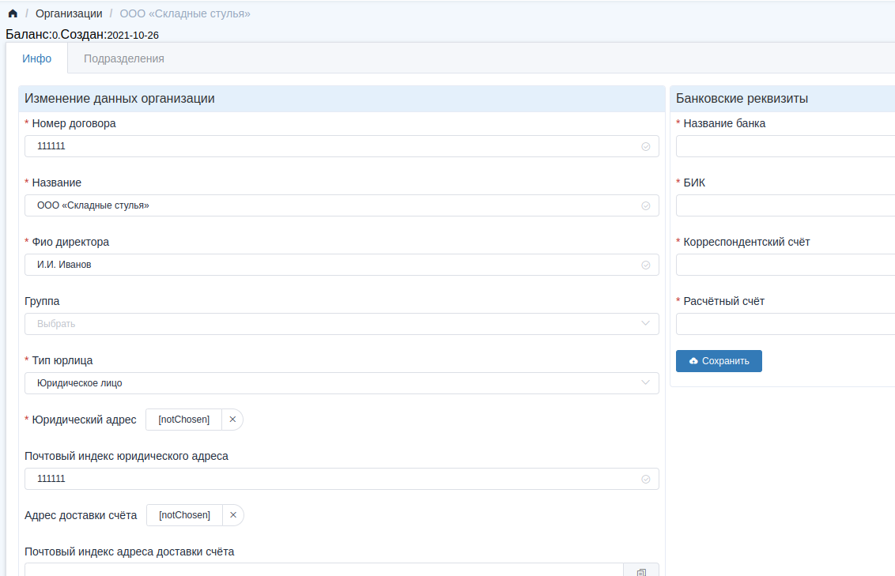

## Принцип создания ЮР лиц и подразделений

## Что есть что

Есть несколько типов учётных записей: Организация, абонент, сотрудник. Сотрудники нам сейчас не важны.
- Абонент - это учётая запись, по которой может предоставляться доступ к инету. Чаще всего это обычные абоненты, физ лица.
- Организация - это учётная запись для Юридических лиц. Она может содержать несколько учётных записей абонентов, назвали их **Подразделения**.

## Как создавать организации и их подразделения

Самое важное тут это договор, и дата начала договора, которая не может меняться после начала. Начало это включение абонентской учётки. Только включенная абонентская учётка пожет получить инет.
Без договора учётка абонента не включается, т.к. без заключения договора нельзя предоставлять услуги.
Есть 2 вида договора: Договор физ абонента, и договор с Юр лицом.
Чтобы учётную запись абонента можно было включить, он должен стать либо <u>подразделением</u> Юр лица, либо физиком.
- Абонент со своим договором во вкладке "Договор абонента" это физик.
- Если там договора нет, то учётка должна быть чьим-то подразделением, только тогда она включится.
Т.е. получается, что у абонентской учётки может быть свой собственный договор, тогда это физик, либо договор может браться из Юр лица, чьим подразделением является эта учётка, тогда она Юр.

##### Догофор физ лица на вкладке абонента:

##### Договор ЮР лица на вкладке "Инфо" Организации:

