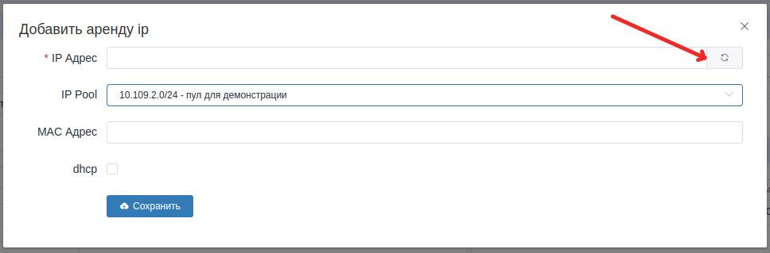
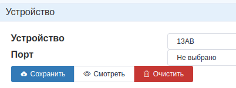
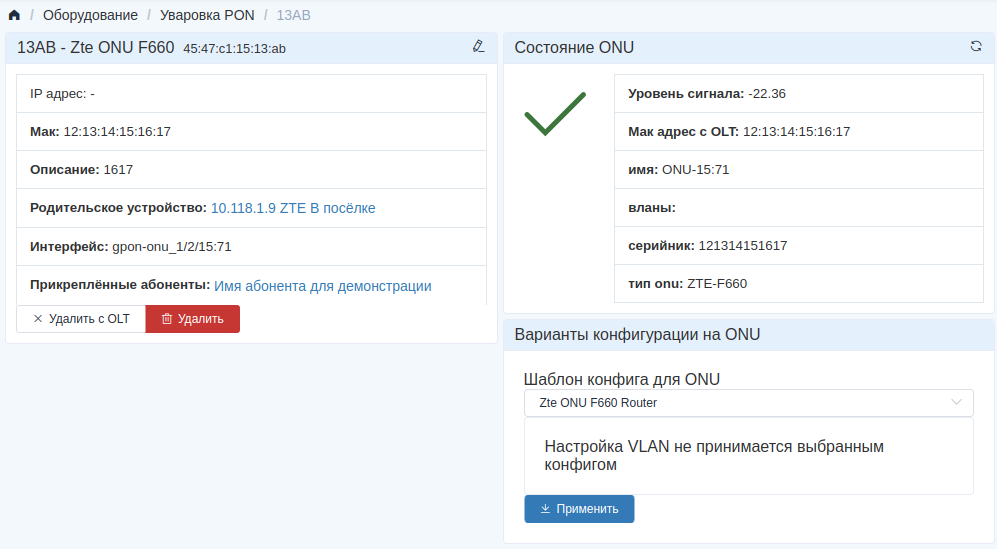
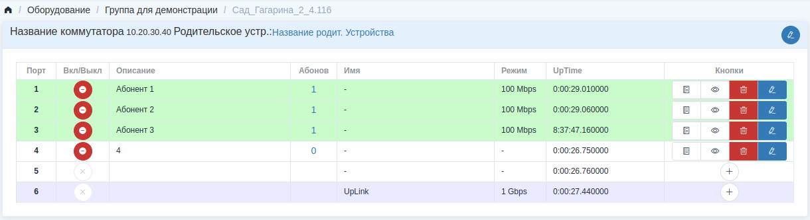
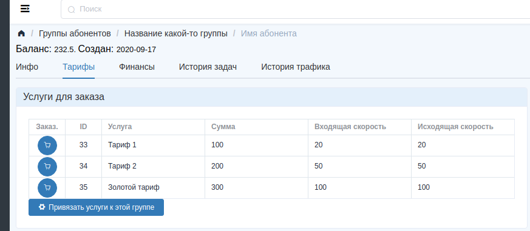
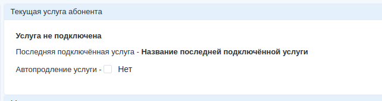

Раздел учётных записей абонентов
================================

Предупреждение:
    Если сразу открыть список абонентов, то вы увидите пустой список,
    и нельзя ничего добавить. Это список групп абонентов, его можно
    создать в разделе *Группы*. В `принципах <../principles>`_
    описан этот момент.


Вкладка "*Инфо*"
-----------------


Блок "*Флаги абонента*"
```````````````````````````````

В блоке *Флаги абонента* можно выставить визуальные метки для абонента,
чтобы в списке абонентов можно было быстро сориентироваться что это
за учётка.
В планах развить эту функциональность, чтоб можно было изменять
набор предустановленных иконок, и их подписи.

Блок "*Сетевое*"
````````````````````

В блоке *Сетевое* можно управлять ip адресами учётной записи абонента.
В форме редактирования или создания нового ip адреса, в случае если
вы добавляете новую аренду ip для абонента в ручную, нужно будет
выбрать ip пул, который вы хотите присвоить абоненту, а далее, либо
вписать ip адрес вручную из диапазона ip пула, либо нажать на кнопку
автоматического подбора свободного ip. Выглядит это примерно как на
скрине ниже.



Блок "*Устройство*"
````````````````````

В этом блоке к учётной записи абонента привязывается устройство,
с которого абонент получает услугу связи. Тут можно быстро посмотреть
базовую информацию по устройству, посмотреть доступно-ли оно.
Для устройств *PON* поле порт, чаще всего, оставляем пустым, т.к.
тут авторизация абонента производится по всему устройству, а не только
по порту, как на коммутаторах доступа.



Если "*Посмотреть*" на устройство, то мы увидим страницу устройства.
Выглядеть она будет по разному, в зависимости от типа устройства, которое
мы открыли.
В случае с PON ONU(ONT) страница будет выглядеть примерно так:



В случае с коммутатором страница будет выглядеть примерно так:



Тут с обозначениями не должно быть проблем. Единственное,
некоторые коммутаторы по snmp отдают не правильое время UpTime.
Подробнее это описано в разделе об `Устройствах <./devices/index>`_.


Вкладка "*Тарифы*"
------------------------

В блоке "*Услуги для заказа*" выводится список тарифов, которые абонент
увидит в `личном кабинете <../lk/index>`_, кроме тех, которые
отмечены как "Административные".
Блок этот выглядит примерно как на скрине ниже.



Изменить этот список можно нажав на "*Привязать услуги к этой группе*".
Откроется диалог "*Принадлежность услуг к группам*".
Перед этим нужно чтоб сами услуги(тарифы) были уже созданы в разделе
"*Тарифы*".


В блоке "Текущая услуга абонента" есть галка "Автопродление услуги".
Если она установлена, то после окончания дествия текущей услуги, если
на счету достаточно средств, эта услуга будет продлена на ещё один
период действия этой услуги. Её абонент может выставлять себе сам
в `личном кабинете <../lk/index>`_.



"*Последняя подключённая услуга*" --- Это та услуга, которая будет подключена
абоненту, если у него появилось достаточно средств на счету, и установлена
галка "Автопродление услуги".
