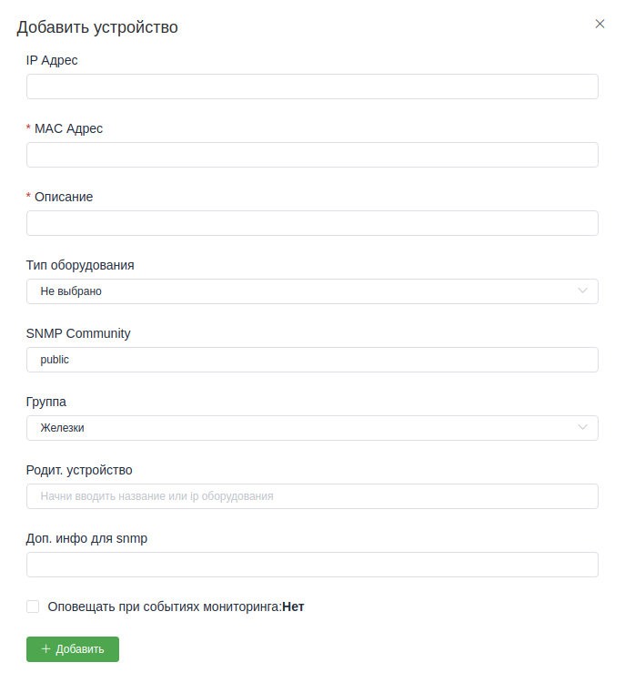

Устройства(раздел "Оборудование")
==================================

Предупреждение:
    Если сразу открыть список оборудования, то вы увидите пустой список,
    и нельзя ничего добавить. Это список групп абонентов, его можно
    создать в разделе *Группы*. В :doc:`принципах <../../principles>`
    описан этот момент.

Открыв список оборудования в какой нибудь группе, можно увидеть список
созданных устройств, или создать новое.
Форма создания нового устройства выглядит примерно так, как на скрине
ниже:

Большинство полей, надеюсь, не нужно пояснять. Но некоторые всё же поясню.

**SNMP Community** --- Это community для опроса устройств по
`SNMP <https://ru.wikipedia.org/wiki/SNMP>`_.
Если он не выставлен сразу, то его можно узнать у вашего системного
администратора, того, кто настраивает оборудование. Если вы не
используйте snmp, то можно заполнять поле значением "public", это
классическое значение для snmp community.

**Группа** --- Это та группа, в которой устройство будет доступно при
его поиске для добавления, например, в учётную запись абонента. Или при
оповещениях сотрудников о событиях в системе.

**Родительское устройство**. Тут указывается устройство, к которому
подключено текущее устройство. Грубо говоря это можно представить как
ветка, на которой держится лист(текущее устройство) в древовидной
схеме сети. Направление имеется ввиду от глобальной сети к абоненту.
т.е. ваши маршрутизаторы находятся ближе к корню, а абоненты это листы.
С помощью этого поля можно рисовать древовидную логическую схему сети.
Такую схему планирую внедрить.

**Доп. инфо для snmp**. Это вспомогательное поле для хранения некоторых
значений для опроса по snmp. Чаще всего заполяется системным
администратором, или автоматическими скриптами. Доступно для редактирования
вручную.

** Оповещать при событиях мониторинга**. Если эта галка установлена, то при
событиях из системы мониторинга об этом будет оповещение всем ответственным
за это оборудование сотруникам.
