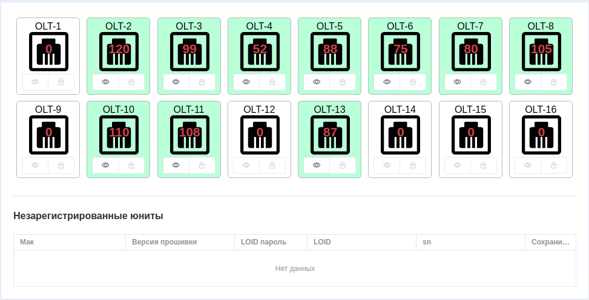

Устройства(раздел "Оборудование")
==================================

Предупреждение:
    Если сразу открыть список оборудования, то вы увидите пустой список,
    и нельзя ничего добавить. Это список групп абонентов, его можно
    создать в разделе *Группы*. В :doc:`принципах <../../principles>`
    описан этот момент.

Добавление нового устройства.
------------------------------

Открыв список оборудования в какой нибудь группе, можно увидеть список
созданных устройств, или создать новое.
Форма создания нового устройства выглядит примерно так, как на скрине
ниже:

.. figure:: ../../assets/devices_new_form.png
    :align: center
    :alt: devices_new_form.png

Большинство полей, надеюсь, не нужно пояснять. Но некоторые всё же поясню.

**SNMP Community** --- Это community для опроса устройств по
`SNMP <https://ru.wikipedia.org/wiki/SNMP>`_.
Если он не выставлен сразу, то его можно узнать у вашего системного
администратора, того, кто настраивает оборудование. Если вы не
используйте snmp, то можно заполнять поле значением "public", это
классическое значение для snmp community.

**Группа** --- Это та группа, в которой устройство будет доступно при
его поиске для добавления, например, в учётную запись абонента. Или при
оповещениях сотрудников о событиях в системе.

**Родительское устройство**. Тут указывается устройство, к которому
подключено текущее устройство. Грубо говоря это можно представить как
ветка, на которой держится лист(текущее устройство) в древовидной
схеме сети. Направление имеется ввиду от глобальной сети к абоненту.
т.е. ваши маршрутизаторы находятся ближе к корню, а абоненты это листы.
С помощью этого поля можно рисовать древовидную логическую схему сети.
Такую схему планирую внедрить.

**Доп. инфо для snmp**. Это вспомогательное поле для хранения некоторых
значений для опроса по snmp. Чаще всего заполяется системным
администратором, или автоматическими скриптами. Доступно для редактирования
вручную.

** Оповещать при событиях мониторинга**. Если эта галка установлена, то при
событиях из системы мониторинга об этом будет оповещение всем ответственным
за это оборудование сотруникам.

Типы оборудования
--------------------
Все устройства в системе поделены на 2 больших семейства, это коммутаторы
с маршрутизаторами, и `PON <https://ru.wikipedia.org/wiki/PON>`_.

Если попробовать открыть устройство, то система попробует опросить
его по snmp на предмет текущего состояния, и отобразит страницу с устройством
в видом, зависящим от типа устройства. Например, если открыть коммутатор,
то мы увидим примерно такую картину:

.. figure:: ../../assets/device_switch.png
    :align: center
    :alt: device_switch.png

А если это будет PON ONU(ONT) то картина будет такой:

.. figure:: ../../assets/device_onu.png
    :align: center
    :alt: device_onu.png

Страница с PON GPON OLT, на примере ZTE C320, будет выглядеть примерно так:

Поддерживаемые типы оборудования:
---------------------------------
* `Dlink DGS-1100-10/ME <https://dlink.ru/ru/products/1/1976.html>`_
* `Dlink DGS-3120-24SC <https://dlink.ru/ru/products/1/1365.html>`_
* `Dlink DGS-1100-06/ME <https://dlink.ru/ru/products/1/2048.html>`_
* `Dlink DGS-3627G <https://dlink.ru/ru/products/1/658.html>`_
* `Eltex MES <https://eltex-co.ru/catalog/aggregation/>`_
* `Huawei S2300 series <https://support.huawei.com/enterprise/en/switches/s2300-pid-16561>`_
* `Huawei S5300 LI AC <http://huawei-russia.ru/huawei-switches/huawei-switch-s5300-series/ls-s5306tp-li-ac-huawei-quidway-s5300-switch>`_
* :download:`BDCOM P3310C <../../assets/bdcom_p3310c.png>`
* :download:`EPON ONU Fora <../../assets/onu-fora-na-1001d.jpg>`
* :download:`OLT ZTE C320 <../../assets/zte_c320.jpeg>`
* :download:`GPON ONU ZTE F660 <../../assets/zte_f660.jpg>`
* :download:`GPON ONU ZTE F601 <../../assets/zte-f601-gpon-onu.jpg>`
