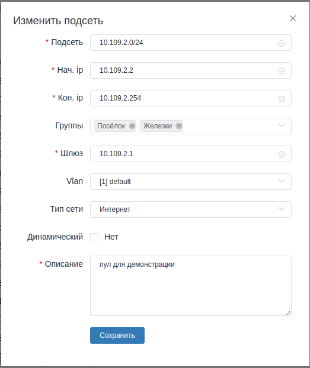

Раздел Сеть
=============

В этом разделе можно управлять гостевыми ip адресами абонентов,
ip подсетями, 802.1q(vlan), и выданными арендами ip адресов.

Гостевые сессии
----------------

**Гостевые ip адреса** раздаются в том случае, если не удаётся найти
учётную запись абонента в билинге по dhcp option82.

Их нельзя создать вручную, можно только удалить. Они создаются автоматически
в рамках работы `RADIUS <https://ru.wikipedia.org/wiki/RADIUS>`_ сервера
`freeradius <https://freeradius.org/>`_.

При удалении гостевой сессии, так же, отправляется сигнал
`COA Disconnect <https://wiki.freeradius.org/protocol/Disconnect-Messages>`_
на `BRAS <https://en.wikipedia.org/wiki/Broadband_remote_access_server>`_.
То же самое происходит если удалить ip адрес на странице абонента.

.. _ui-networks:
Подсети
--------

При создании или изменении подсети обратите внимание на поля *Группы*, *Vlan*, *Тип сети*
и *Динамический*. Об их назначении ниже. Остальные, думаю, пояснять не нужно.
Форма редактирования(создания) подсети выглядит примерно так, как показано на
скрине ниже:




Поле "Группы"
``````````````
В выбранных в этом поле группах абоненты будут получать ip из этой подсети
при условии, что "Тип сети" выставлен в *Интернет*.

Поле "Vlan"
````````````
В выпадающем списке vlan выберите тот, в котором предполагается работа
текущей подсети. Даже если у вас что-то типа *ARP proxy*, всё равно можно
определить примерные подсети, которые будут работать в разных группах.
Мне кажется логичным разделять разные группы абонентов в разные подсети,
чтоб можно было управлять их политиками проще.

Поле "Тип сети".
`````````````````
В выпадающем списке "Тип сети" есть несколько предопределённых типов подсетей.
Билинг никак не настраивает и не контролирует политики доступа выбранных типов,
это может помочь вам самостоятельно определять нужную политику для абонента
в зависимости от того, что выбрано в подсети.

**Интернет**. Подсети с этим типом предполагается раздавать абонентам для
использования услуг доступа к всемирной паутине :)

**Гостевой**. IP адреса из этой подсети предполагается раздавать когда
не получается найти учётную запись абонента, или её ещё нет.

**Доверенный** --- эта подсеть для супердоступа, ip из этой подсети
не имеют никаких ограничений.

**Устройства** --- предполагается, что в подсетях такого типа будет находится
оборудование.

**Административный** тип можно использовать для всякого рода технических нужд,
например, подсеть из которой будет доступ на важные устройства, к которым важно
ограничить доступ из других подсетей.

Поле "Динамический"
````````````````````
Если эта галка установлена, то этот пул будет использоваться для поиска свободных
ip для абонентов для выдачи через, например, dhcp.
Можно добавить в одну группу несколько подсетей, и выдаваться абонентам будут только
те ip, в подсетях которых стоит галка "Динамический".

Вланы
------
Тут просто. Список vlan, которые есть в сети, используется, например, разделом
:ref:`Сети <ui-networks>`.

Следить за изменениями vlan в сети может быть не удобно, можно просканировать
устройства в сети и загрузить с них. Можно почитать об этом
:ref:`тут <ai-management-scan-vlan-on-device>`.

Галка "Управление" указывает на то, что этот влан нельзя трогать при
автоматическом конфигурировании, чтоб не потерять оборудование, в котором оно находится.

Аредны ip
----------
Это список выделенных абонентам ip адресов.
