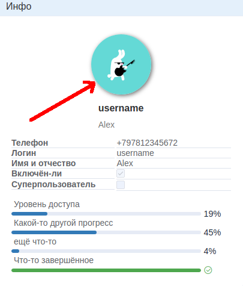
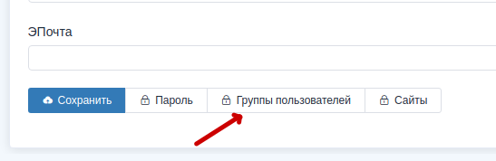
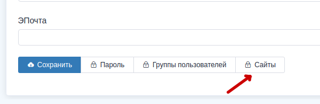

Раздел учётных записей сотрудников
==================================

Предупреждение:
    В данном разделе будут описаны возможные, не интуитивные моменты.

Учётные записи сотрудников далее буду называть *профилями*.

Создание нового профиля
-------------------------------

Поля, отмеченные красной звёздочкой (*), обязательны к заполнению.
Создавать и редактировать учётные записи кроме своей может только
суперпользователь.

После создания профиля можно изменить аватар. Но имейте ввиду,
что изменять можно только **свой** аватар, даже если вы
суперпользователь.
Для того чтобы изменить его, нажмите на изображение
аватара как на скрине ниже.

    Блок *Инфо* профиля сотрудника.

Функциональные кнопки на вкладке *Изменить*
-----------------------------------------------

К этим кнопкам, так же, имеет доступ только суперпользователь.

Кнопка **Группы пользователей** изменяет участие профиля в
группах профилей. **Группы профилей** это набор
:doc:`прав доступа <../rights/index>`.
Можно один раз настроить права доступа для разных ситуаций, а
потом добавлять или удалять оттуда профили, и для них будут действовать
те права, которые назначены в тех группах, в которых состоит
профиль.

    Кнопка *Группы пользователей*.

Кнопка **Сайты** управляет доступностью профиля на разных
:doc:`сайтах <../sites/index>`.

    Кнопка *Сайты*.

Кратко, сайты это модуль из `Django <https://docs.djangoproject.com/en/3.1/ref/contrib/sites/>`_,
который позволяет отображать содержимое в зависимости от домена, с
которого зашли на сайт.

.. _ui-profile-group-responsibility:

Вкладка Ответственность за группы
---------------------------------------

На этой вкладке можно отметить те группы, к которым имеет отношение
профиль. Например, при оповещении о событиях устройств профиль получит
это оповещение, только если ответственен за эту группу. Или, при создании
новой задачи по абоненту, в поле "*Исполнители*" профиль будет добавлен
автоматически.

Вкладка Права на классы действий
---------------------------------------

Подробнее про работу прав читайте в разделе о
:doc:`правах доступа <../rights/index>`.
Если кратко, то тут можно выбрать для профиля классовые права,
которые будут ограничивать доступ по принципу: можно смотреть абонента,
можно изменять абонента, и.т.д. Чтобы управлять доступом к конкретным
объектом нужно настроить "*Объектные права*".
