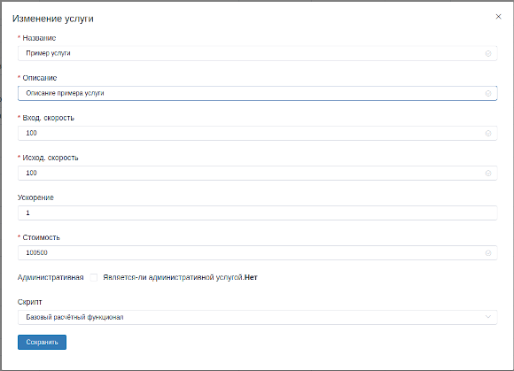

Раздел тарифов
==============

В разделе о тарифах и услугах есть несколько типов тарифов.
каждый из них может иметь свою логику расчётов.
Есть обычные тарифы для предоставления услуг интернета,
есть *периодические платежи*, и есть единоразовые платежи.
Подробности о каждом читайте дальше.


Тарифы "интернет"
------------------

Это тарифы(услуги) абонент может выбрать в личном кабинете, может
продливать и видеть подробности по купленной им услуге. В зависимости
от логики расчёта, эти тарифы могут длится разное время, по разному
считать оплату абонента, по разному себя вести при досрочном завершении
услуги из админки или личного кабинета.
Если открыть форму дерактирования тарифа, то среди очевидных полей
есть галка "*Административная*" и выпадающий список "*Скрипт*".
Форма выглядит примерно как на скрине ниже:




Подробности о каждом поле ниже.

Поле "Административная"
````````````````````````
Если установлена эта галка, то абонент не сможет повлиять на эту сулугу
из личного кабинета.

Поле "Скрипт"
``````````````
Это поле позволяет выбрать поведение тарифа.

**Базовый расчётный функционал** имеет базовую логику:
услуга действует от певого дня месяца до последнего.
Но если абонент включил услугу, например, 15 мая, то завершится
услуга всё равно 31го мая, вернув оставшиеся, не использованные средства
абонента на счёт. *ВНИМАНИЕ!* С этим есть тонкость, подробности читайте
в :doc:`известных проблемах <issues>`.

**IS** действует как и Базовый расчётный функционал, но при
досрочном завершении услуги не возвращает абоненту на баланс
не использованные средства.

**Вечная услуга** действует как и "IS", но только срок действия
10 лет. Используется для абонентов, для которых недопустимы перебои
связи. Абоненты могут платить другим образом, главное чтоб услуга не заканчивалась.

**Суточная** услуга так же действует как и "IS", но время действия 1 сутки.
С момента включения абонентом услуги в течении 24х часов. Обычно стоит не дорого.
Можно использоваться абонентами, которые редко бывают дома, и интернет им нужен
только несколько дней в месяце.


Периодические платежи
----------------------

На эти платежи абонент не может повилять, это нужно для периодических списаний
средств со счёта абонента, можно использовать, например, для платежей за аренду
какого-то дополнительного оборудования. Логи о списаниях абонент видит в
:doc:`личном кабинете <lk/index>`.
Платежи списываются с абонентов с периодичностью в месяц.
Планирую развить этот функционал.

Единоразовые платежи
--------------------
Когда нужно списать абоненту средства со счёта один раз, и чтоб он увидел
это в личном кабинете. Можно использовать, например, чтоб сотрудники не
принимали средства за услуги наличкой, или, если у абонента просто нет сейчас
возможности заплатить.
Так же планирую развить этот функционал.
