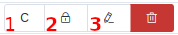

Как устроены таблицы
=====================

В некоторых таблицах, для учётных записей суперпользователя есть несколько
кнопок, позволяющих настраивать доступность элементов для
:doc:`сайтов <sites/index>`.
Выглядят они примерно так:

**1** --- Это кнопка управления доступностью на сайтах.
Там, где проставлены галки, на тех сайтах будет доступен
объект на против которого была нажата данная кнопка.

**2** --- Это кнопка управления правами. В выпадающем списке можно выбрать
для какой группы назначаются права, а снизу непосредственно права, которые
назначаются на оръект, на против которого была нажата эта кнопка.

**3** и **4** Это кнопки редактирования и удаления объекта.
